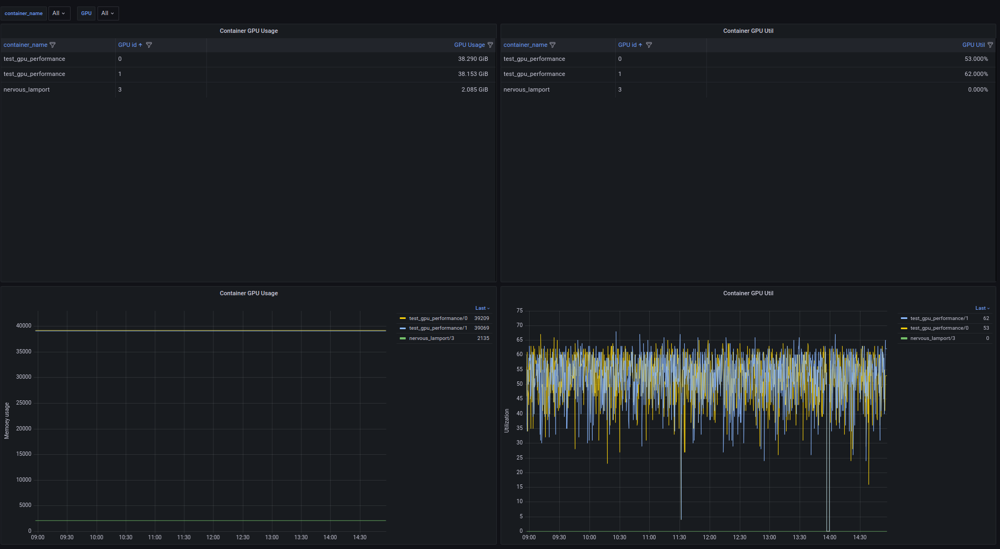

# Docker Container GPU Exporter

## Quick start
Currently the exporter only works as a service (next will be containarized).
1- Run ```python3 docker_gpu_exporter_v3.py```
2- Check the  http://hostname:9066 to make sure it expose the metrics.
3- Register ```hostname:9066``` to your Prometheus configration file.
Prometheus configuration example:

```yaml
- job_name: 'docker_container_gpu_metrics'
  static_configs:
    - targets: ["hostname:9066"]
```

## Exported metrics
This exporter will expose these metrics corresponding to each container name and GPU:
- ```container_running_gpu_pid```
- ```container_name```
- ```container_used_gpu_id```
- ```container_utilization_gpu_percent```
- ```container_gpu_memory_used_MiB```
- ```container_total_gpu_used```

Download Grafana dashboard [Here](Docker_container_gpu_JSON_model.json)
## How it works
Using a bash script to:
- Running ```nvidia-smi``` and grep all processes that uses GPU.
- Loop through processes and run:
    - ```nvidia-smi pmon -c 1``` to get the current process utilization of the memory and which GPU id it's uses.
    - Then run ```nvidia-smi --query-compute-apps=pid,process_name,used_memory --format=csv``` and grep GPU usgage of the process.
    - Last thing we map the PID to container name.

- Then we used promethous-client to parse and construc the metrics.


## TODO
1- ~~Exprot metrics container GPU metrics~~
2- Dockerizing (Require ```-v /var/run/docker.sock:/var/run/docker.sock``` and visiability to host GPU processes).
3- Enhance Grafana dashboard.